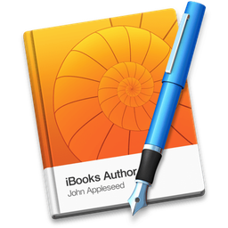
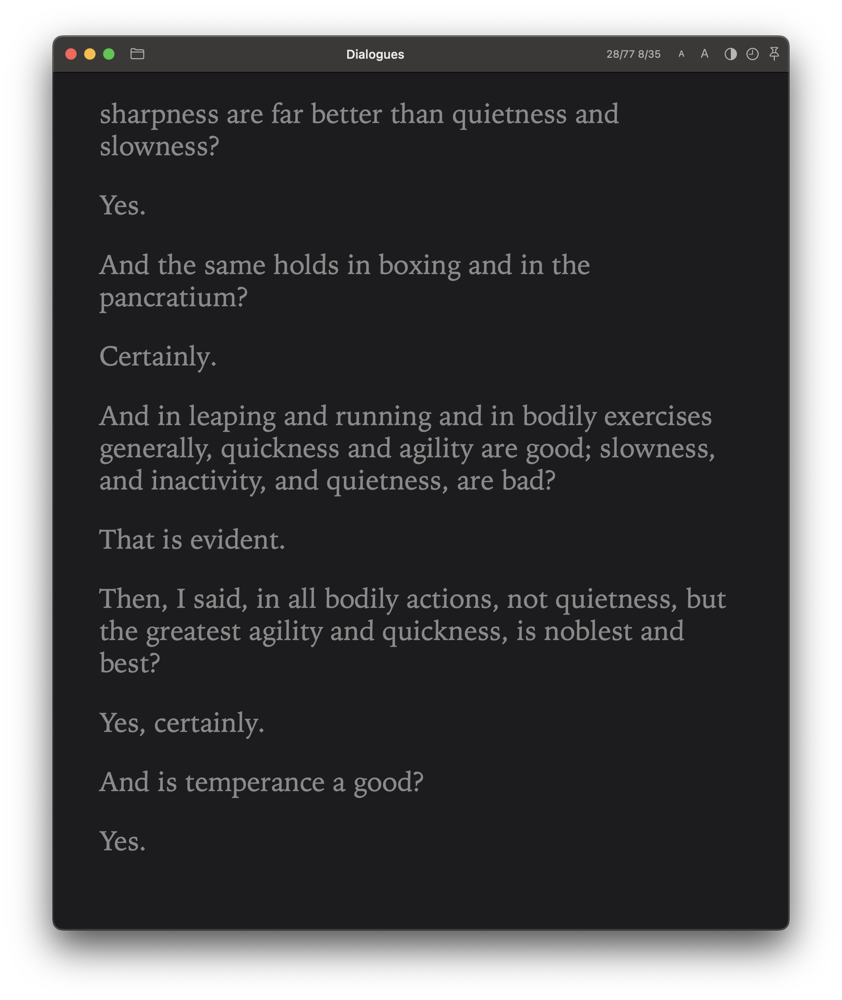
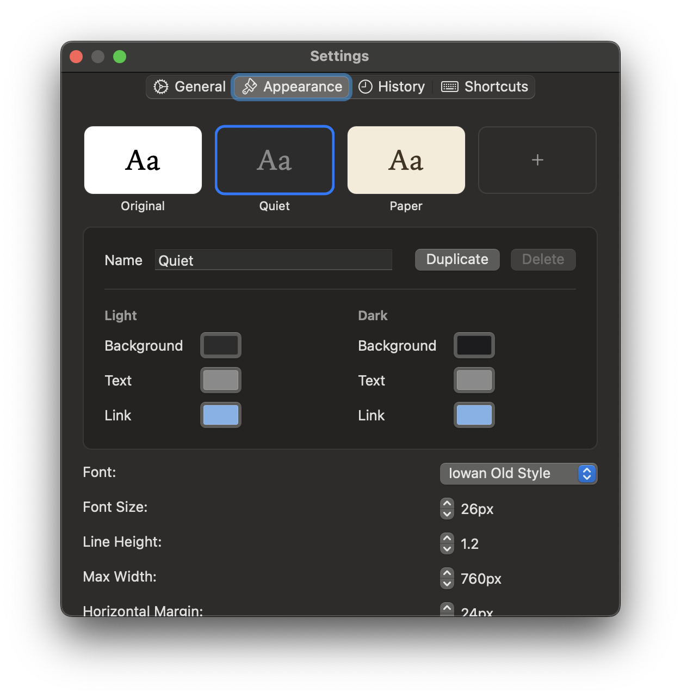
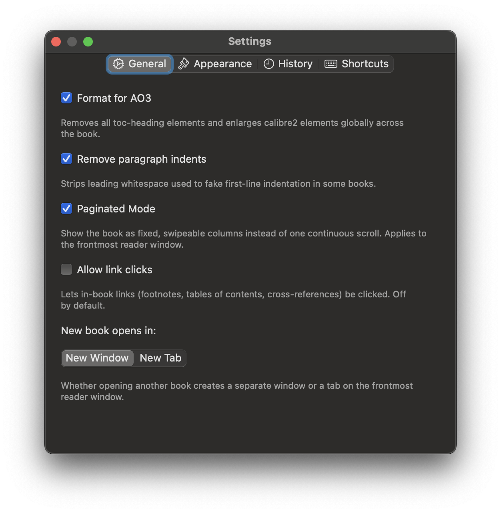
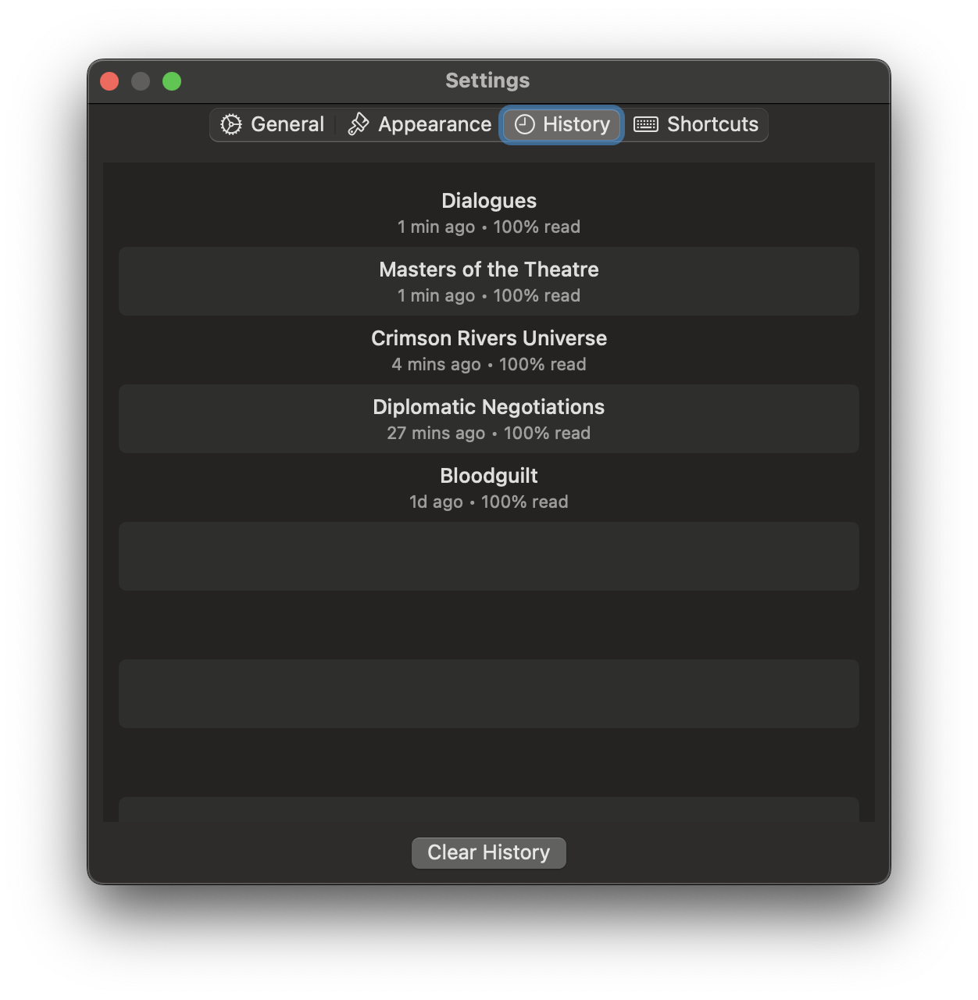

# Honeycrisp Reader

<p align="center">
  
</p>

A native macOS EPUB standalone reader, inspired by this [EPUBQuickLook plugin](https://github.com/arytek/epub-quicklook-extension).

Built using claude and gemini because I hate swift.

Check out https://github.com/kyrielie/ambrosia, a macos library and reader for massive fanfiction libraries. 
Also https://github.com/kyrielie/nectar its ios app companion reader.

## Screenshots

### Reader



### Settings

<table>
<tr>
<td></td>
<td></td>
<td></td>
</tr>
</table>


## Installation

Download release to try, try to open then click open anyways in Settings / Privacy & Security

Or bypass macos gatekeeper.

```bash
xattr -d com.apple.quarantine /path/to/app
```

## Features

- **Persistent windows** — stays open, unlike Quick Look
- **Multiple windows** — open several books simultaneously (File > Open, or ⌘O)
- **Tabbed mode** - open multiple books as tabs in the same window
- **Paginated mode** — one spine document per "page", navigate with ← → arrow keys
- **Scroll mode** — all chapters merged into one continuous scroll
- **Float on top** — pin any window above all others (⌘⇧T or toolbar pin button)
- **Reading history** — recent books saved with open date, accessible via clock toolbar button
- **Themes** - save your prefered formatting as a theme
- **Dark mode** — automatic, follows system appearance
- **Page counter** - page / total pages (and spine / total spines in paged mode)
- **Table of contents** - quickly flick through books

## Non-goals

These are intentional scope boundaries, not missing features:

- **No library view** — File > Open, drag-drop, and the History popover are the only ways to open a book. Honeycrisp is a reader, not a library manager; see [ambrosia](https://github.com/kyrielie/ambrosia) for that.
- **No cross-library full-text search** — search is scoped to the currently open book only.
- **No publisher CSS** — Honeycrisp deliberately strips inline/publisher styling and applies its own reader CSS (Lora typeface, warm paper palette). This is by design, not a rendering bug.
- **No "share quote"** — without a metadata parser for title/author/ISBN, there's nothing reliable to attribute a quote to, so this isn't offered.
- **No per-window/per-book reading mode** — paginated vs. scroll mode is a single global default (Settings' General tab); every window and every book opens in whichever mode was last chosen.

## Keyboard shortcuts

| Key | Action |
|-----|--------|
| ← / → | Previous / next page (paginated mode) |
| ↑ / ↓ | Scroll up/down (scroll mode) |
| Page Up / Page Down | Previous / next page or large scroll |
| ⌘O | Open EPUB file |
| ⌘W | Close window |
| ⌘⇧T | Toggle float on top |

## Building

### Xcode (recommended)

1. Open `Honeycrisp.xcodeproj` in Xcode 15+
2. Xcode will automatically resolve the ZIPFoundation Swift Package dependency
3. Select the **Honeycrisp** scheme → **My Mac** destination
4. Press ⌘R to build and run

> **Note:** Set your own Team in Signing & Capabilities if you see code signing errors.

### Requirements

- macOS 13.0+ (Ventura or later)
- Xcode 15+
- ZIPFoundation (fetched automatically via Swift Package Manager)

## Architecture

| File | Responsibility |
|------|---------------|
| `EPUBReaderApp.swift` | SwiftUI `@main` entry point, boots `AppDelegate` |
| `AppDelegate.swift` | Application lifecycle, menu bar, window creation |
| `ReaderWindowController.swift` | Per-window chrome, float-on-top, toolbar scaffold |
| `ReaderViewController.swift` | WebKit rendering, pagination, keyboard nav, toolbar items |
| `EPUBParser.swift` | ZIP extraction, OPF/spine parsing, HTML generation |
| `HistoryManager.swift` | Persists recently opened files with security-scoped bookmarks |
| `HistoryViewController.swift` | Popover showing recent books with open/remove actions |

The QuickLook plugin (`EPUBQuickLook`) provided the `EPUBParser` core and the basic WebKit rendering approach. (I think, I just told claude to use it.)

- Full `NSWindowController` lifecycle with multiple independent windows
- Paginated reading mode driven by the spine order
- Arrow key navigation with `ReaderWindow` key forwarding
- Window-level floating (`.floating` NSWindow level)
- Persistent history via `UserDefaults` + security-scoped bookmarks
- Toolbar with mode switcher, page indicator, history popover, pin button
- Opinionated reader CSS that strips all EPUB styles (Lora typeface, warm paper palette)

## License

MIT
